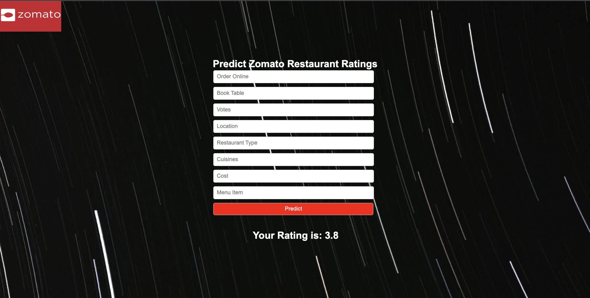

# Zomato Restaurant Rating Prediction

---

This project focuses on predicting the ratings of restaurants listed on Zomato based on various features. The project includes extensive exploratory data analysis (EDA), building a machine learning model using ExtraTree Regressor, and deploying the model using Flask to create a web application for live predictions of restaurant ratings.

## Dataset

The dataset used in this project contains information about restaurants in Bengaluru, including features such as the restaurant's URL, address, name, online ordering availability, table booking option, overall rating, number of votes, phone number, location, restaurant type, popular dishes, cuisines, approximate cost for two people, reviews, menu items, and the type of meal and city in which the restaurant is listed.

## Objective

The main objective of this project is to predict the ratings of Zomato restaurants based on the provided features. This is a regression problem, where the ratings range from 1 to 5.

## Project Overview

1. Exploratory Data Analysis (EDA): Perform comprehensive EDA on the Zomato dataset to gain insights into the data, understand its structure, and identify relationships between variables.

2. Data Preprocessing: Clean the dataset by handling missing values, transforming features, and encoding categorical variables.

3. Feature Engineering: Create new features or extract meaningful information from existing features to improve the performance of the machine learning model.

4. Machine Learning Model Building: Build a regression model using ExtraTree Regressor to predict the restaurant ratings based on the selected features.

5. Model Evaluation: Evaluate the performance of the machine learning model using appropriate evaluation metrics such as mean squared error (MSE), mean absolute error (MAE), and R-squared.

6. Model Deployment: Deploy the trained machine learning model using Flask to create a web application. This application will allow users to input restaurant features and receive live predictions of the restaurant's rating.

## Model Performance

The trained ExtraTree Regressor model achieved an accuracy of 93% on the Zomato restaurant rating prediction task. The accuracy was evaluated using appropriate regression evaluation metrics such as mean squared error (MSE), mean absolute error (MAE), and R-squared.

## Project Structure

The project structure is organized as follows:

- **data**: This folder contains the Zomato dataset and any other required data files.

- **notebooks**: This folder contains Jupyter notebooks used for data analysis, preprocessing, feature engineering, and model training.

- **models**: This folder contains the trained machine learning model or any serialized model artifacts.

- **static**: This folder contains the static files required for the web application, such as CSS files and images.

- **templates**: This folder contains the HTML templates used for rendering the web application.

- **app.py**: This file contains the Flask application code for handling web requests and making predictions using the deployed machine learning model.

- **requirements.txt**: This file lists all the Python dependencies required to run the project.

- **README.md**: This file provides information about the project, its objectives, methodology, and instructions on how to set up and run the project.

## Getting Started

To get started with the project, follow these steps:

1. Clone the repository to your local machine.

2. Install the required dependencies by running `pip install -r requirements.txt` in your command-line interface.

3. Ensure that you have Python 3.7 or later installed on your machine.

4. Run the Jupyter notebooks in the `notebooks` folder to perform exploratory data analysis, data preprocessing, feature engineering, and model training.

5. Once the model is trained and evaluated, run the Flask application using the command `python app.py`. This will start the Flask server and host the web application.

6. Open your web browser and go to `http://localhost:5000` to access the Zomato restaurant rating prediction web application.

## Conclusion

This project showcases the process of predicting restaurant ratings using machine learning techniques. By performing exploratory data analysis, building an ExtraTree Regressor model, and deploying it using Flask, we can provide live predictions of restaurant ratings to assist Zomato users in making informed dining choices. The project can be further extended by incorporating more advanced machine learning algorithms, optimizing the model hyperparameters, and enhancing the web application's user interface.
